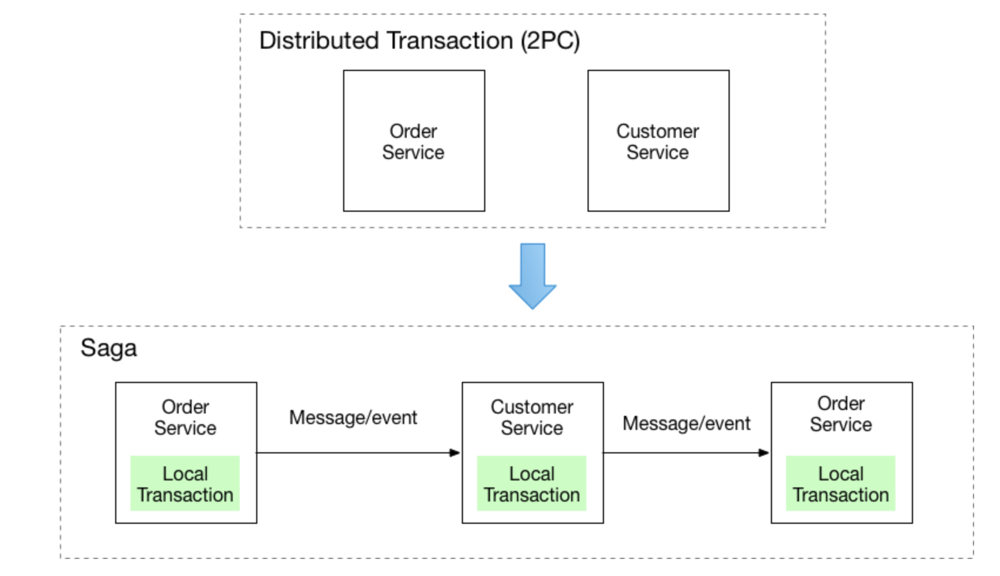
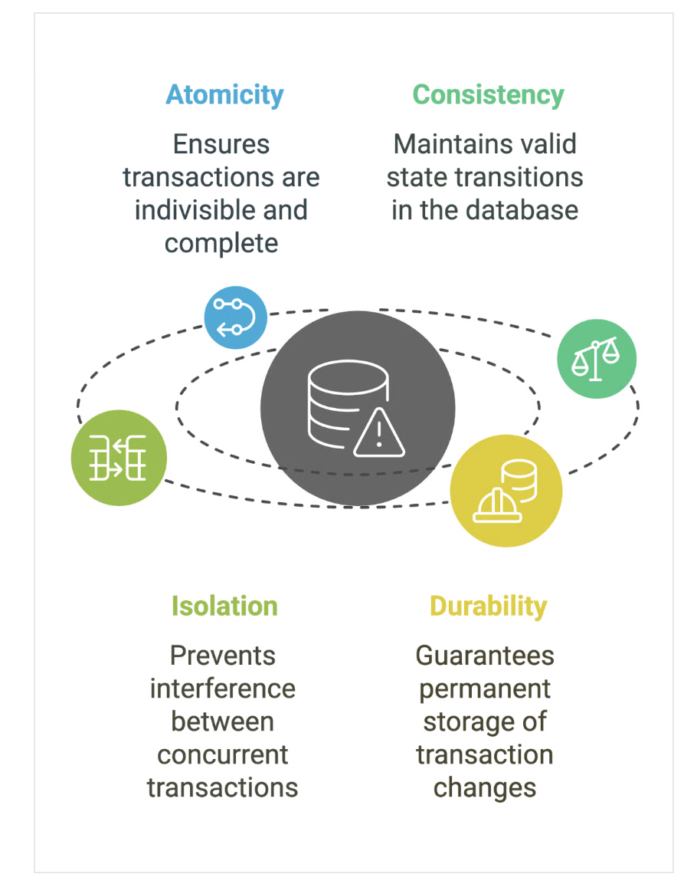

# Social

## Tech stack
- go 
- docker
- postgres
- swagger
- golang migrate

## directory structure
- bin: compiled binaries
- cmd: main executable or entry point of the application
    - api: anything server related in api
    - migrate: own migrations implementation
        - migrations: migrations
- internal: internal packages
- docs
- scripts
- web: web server or frontend implementation

## References
- clean architecture by Robert C. Martin

## Principles
### Separation of concerns
- Each level of your program should be seprate by a clean barrier
    - Transport layer
    - Service layer
    - Storage layer

### Dependency Inversion Principle (DIP)
- You're injecting dependencies in your layers. you don't directly call them.
- Why? It promotes loose coupling and makes it easier to test ur program

### Adaptability to change
- By organizing your code in a moduler and flexible way. you can more easily introduce new features, refactor existing code.
- And respond to buisiness requirements.
- Your system should be easy to change, If you have to change lot of existing code to add a new feature you're doing it wrong.

### Focus on Buisiness Value
- And finally focus on delivering value to the users, they are the ones who will be paying your bills at the end of the month.
- So focus on the buisiness value.

### Layers
- Transport: The way we communicate between micro services and deliver messages to client(users)
    - http, grpc
- Service Layer: Buisiness logic or Application logic
- Storage Layer: Abstraction between layers above and below
    - logic to communicate with databases and provide read and write feature.
    - the layers above such as application logic should not know about the underlying database and it's config
    - the layers below such as database, cache etc. should not need to be depend or know about the application logic.

### Layers In Code: 
    - HTTP Handlers, these handlers will inject the layers which is going to be dependencies
    - Injected dependencies depend on the abstration not on the implementation
        - In terms of golang, we have dependency on interface not structs
        - Structs implement interfaces, which then you can have multiple implementations of interfaces
        - And just inject them into application at runtime.
        - Which allow us to inject logic into layers at run time
        - Which allow us to implement tests from handlers layer
            - Which means we can inject mock service and mock storage layers and test the implementation.
    - HTTP Handlers will recieve service layer and it will be injected directly
        - In service layerwe are going to inject repository

## The flow of the request
- User request HTTP Request, using api
- Request reaches to HTTP handlers
- Handler route the request to the appropriate handler
- And then the request reaches to the service
    - This service is going to be injected, service takes care of the buisiness logic (app.CreateAndInviteUsers())
    - delegating the creation or invte of the user to the repository
- Service communicates with the repository
    - repository implements access/modify/delete logic of the storage records
    - CreateUser() or CreateInvite() wich will create records on external database.
- Service and Repostiroy compose together as a transaction. These transactions can follow SAGA pattern. 
    - But email communication sent can not be reverted, so sending another email saying transaction failed and try again would make sence.

## Saga pattern
- You have applied the Database per Service pattern. Each service has its own database. 
- Some business transactions, however, span multiple service so you need a mechanism to implement transactions that span services.
- For example, let’s imagine that you are building an e-commerce store where customers have a credit limit. 
    - The application must ensure that a new order will not exceed the customer’s credit limit.
    - Since Orders and Customers are in different databases owned by different services the application cannot simply use a local ACID transaction.
- To solve this problem follow SAGA pattern
- Implement each business transaction that spans multiple services as a saga.
- A saga is a sequence of local transactions.
- Each local transaction updates the database and publishes a message or event to trigger the next local transaction in the saga. 
- If a local transaction fails because it violates a business rule then the saga executes a series of compensating transactions that undo the changes that were made by the preceding local transactions.

- There are two ways of coordination sagas:
    - choreography - each local transaction triggers domain events that trigger local transaction in other services
        - It is event driven can be achieved using kafka
        - Example tools: kafka, rabbitMQ, SNS/SQS, etc.
    - Orchestration - An orchestrator (object) tells the participants what local transaction to execute.
        - It is centralized orchestration, can be achieved using temporal workflow orchestrator
        - Example tools: cadence, step functions, temporal

### SAGA Benefits
- It enables an application to maintain data consistency across multiple services without using distributed transactions

### SAGA Drawbacks
- Lack of automatic rollback - a developer must design compensating transactions that explicitly undo changes made earlier in a saga rather than relying on the automatic rollback feature of ACID transactions
- Lack of isolation (the “I” in ACID) - the lack of isolation means that there’s risk that the concurrent execution of multiple sagas and transactions can use data anomalies.
- consequently, a saga developer must typical use countermeasures, which are design techniques that implement isolation.
- Moreover, careful analysis is needed to select and correctly implement the countermeasures.

## ACID Transactions
> https://www.datacamp.com/blog/acid-transactions?utm_cid=19589720824&utm_aid=152984013334&utm_campaign=230119_1-ps-other~dsa~tofu_2-b2c_3-apac_4-prc_5-na_6-na_7-le_8-pdsh-go_9-nb-e_10-na_11-na&utm_loc=2702-&utm_mtd=-c&utm_kw=&utm_source=google&utm_medium=paid_search&utm_content=ps-other~apac-en~dsa~tofu~blog~data-engineering&gad_source=1&gad_campaignid=19589720824&gbraid=0AAAAADQ9WsEr_bX8ZOw-edBWO5fODzlpP&gclid=CjwKCAiA55rJBhByEiwAFkY1QLLcRB6BhcrRfzYJFU6CjMwBrZAX8S9S6zdMExLsOD7szmutRnXipRoCgsIQAvD_BwE

- Ever wondered how databases keep your data safe and consistent?
- Imagine a customer calling, confused because their money was deducted but never credited to the recipient, or an order went through without updating the inventory.
- These problems happen when data integrity isn’t enforced. That’s where ACID principles come in.
- ACID principles are enforced to ensure every transaction is processed reliably, keeping data safe and systems running smoothly. 
- Understanding these principles is key to building reliable and fault-tolerant systems.

- ACID transactions refer to four properties that ensure the reliable processing of database transactions.
    - Atomicity
    - Consistency
    - Isolation 
    - Durability    
- These principles guarantee that transactions are executed fully, without partial updates or data corruption, even in the case of system failures. 
- ACID transactions are critical in scenarios where data integrity is paramount. 
    - In banking transactions, ACID guarantees that money is either fully transferred or not at all, preventing issues like partial transfers or double deductions. 
    - In e-commerce, ACID principles ensure customer orders are processed correctly, payments are completed, and inventory updates reflect real-time stock levels.
    - Similarly, in inventory management systems, ACID maintains consistency by preventing stock discrepancies due to concurrent transactions.

### Atomicity
- Atomicity is a property that means a group of operations is treated as a single, indivisible unit; it is either completed entirely or not at all. 
- Atomicity guarantees that a transaction is treated as a single, indivisible unit. 
- This means that all operations within a transaction must either be completed fully or not at all. 
- If any part of the transaction fails, the system rolls back the entire transaction, ensuring no partial updates occur.

### Consistency
- Consistency ensures that a transaction brings the database from one valid state to another while adhering to predefined rules or constraints.
- After completing a transaction, the data must meet all the database's integrity rules.
- Example: 
    - In banking, consistency ensures that the total balance across all accounts remains unchanged after a transfer.
    - For example, if $100 is transferred between accounts, the sum of both account balances remains the same to preserve the accounting rules.

## Isolation
- Isolation prevents transactions from interfering with each other.
- When multiple transactions are executed simultaneously, isolation ensures they don't affect each other’s outcomes.
- Each transaction must be isolated to avoid conflicts – especially in high-concurrency environments.
- Example:
    - If two customers attempt to purchase the last item in stock at the same time, isolation ensures that only one transaction will succeed, and the inventory is updated correctly to reflect the change.

### Durability
- Durability guarantees that once a transaction is completed, its changes are permanently stored in the database (even if the system crashes immediately afterward).
- This ensures that the data remains intact and accessible after failures.
- Example:
    - In an e-commerce system, durability ensures that the order data is saved to the database after a customer completes a purchase.
    - Even if the server crashes moments later, the purchase record remains intact and can be retrieved when the system is restored.

